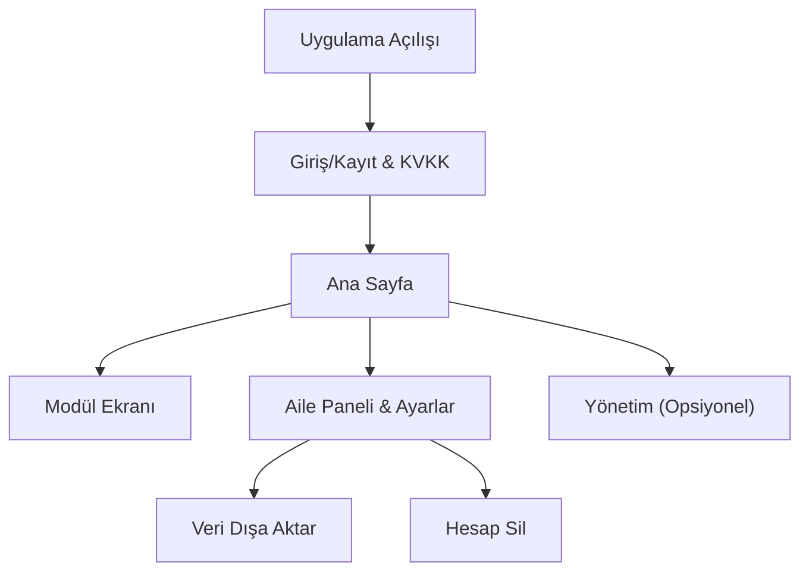

## 1. Product Overview
Otizm destek web uygulamasındaki mevcut modülleri Android/iOS’ta Flutter ile sunan mobil uygulama.
E-posta/şifre ile giriş, KVKK onayı, çocuk profili ve eğitim modüllerine hızlı erişim sağlar.

## 2. Core Features

### 2.1 User Roles
| Rol | Kayıt Yöntemi | Temel Yetkiler |
|------|----------------|----------------|
| Kullanıcı (Aile/Bakıcı) | E-posta + şifre ile kayıt | Modülleri kullanma, profil/ayar yönetme, veri dışa aktarma ve hesap silme |
| Yönetici | Sunucuda tanımlı yönetici e-postası ile giriş | İstatistik ekranını görüntüleme |

### 2.2 Feature Module
1. **Giriş/Kayıt & KVKK**: e-posta/şifre ile giriş-kayıt, KVKK açık rıza onayı.
2. **Ana Sayfa**: modül kartları, aktif çocuk profili özeti, çıkış, (varsa) yönetici bağlantısı.
3. **Modül Ekranları**: Bilgilendirme, OSB, Duygularım, Sosyal Öyküler, Müzik ve Ses, ACC (İletişim Kartları), Takvim ve Program, Eğitici Oyunlar (alt oyunlar).
4. **Aile Paneli & Ayarlar**: çocuk profili yönetimi, kullanıcı bilgileri/iletişim, gizlilik işlemleri.

> Opsiyonel: Offline kullanım (içerik/ayar önbelleği), Push bildirim (takvim hatırlatmaları).

### 2.3 Page Details
| Page Name | Module Name | Feature description |
|-----------|-------------|---------------------|
| Giriş/Kayıt & KVKK | Kimlik doğrulama | Giriş yapma, kayıt olma, oturum durumunu kontrol etme |
| Giriş/Kayıt & KVKK | KVKK açık rıza | Onay alma ve sunucuya onayı kaydetme |
| Ana Sayfa | Modül menüsü | Modülleri kart/grid halinde listeleme, modül ekranına yönlendirme |
| Ana Sayfa | Profil özeti | Aktif çocuk adı/doğum tarihi/fotoğraf özetini gösterme |
| Ana Sayfa | Oturum yönetimi | Çıkış yapma |
| Modül Ekranları | İçerik görüntüleme | İlgili modül içeriğini gösterme (Bilgilendirme/OSB/Duygular/Öyküler/Müzik/ACC/Takvim/Oyunlar) |
| Modül Ekranları | Oyunlar | Oyun listesini gösterme ve alt oyunları açma (Boyama, Sayma, Eşleştirme, Hafıza, Şekiller) |
| Aile Paneli & Ayarlar | Çocuk profilleri | Profil oluşturma/düzenleme, aktif profili seçme, not alanlarını yönetme, fotoğraf ekleme |
| Aile Paneli & Ayarlar | Kullanıcı bilgileri | Ad-soyad, telefon; eğitmen ve doktor telefonu kaydetme |
| Aile Paneli & Ayarlar | Gizlilik işlemleri | Veriyi dışa aktarma (JSON), hesabı şifre ile silme |
| Yönetim (Yalnız yönetici) | İstatistikler | Kullanıcı/sesssion/KVKK/profil sayıları ve profil özet listesini görüntüleme |
| (Opsiyonel) | Offline önbellek | Son görüntülenen içerikleri ve profil özetini cihazda saklama; çevrimdışıyken okuma |
| (Opsiyonel) | Push bildirim | Takvim etkinlikleri için hatırlatma bildirimleri gönderme |

## 3. Core Process
**Kullanıcı akışı:** Uygulamayı aç → giriş/kayıt → KVKK onayı (ilk kullanım) → ana sayfadan modül seç → modülü kullan → gerekirse aile panelinden çocuk profili/iletişim bilgilerini güncelle → ayarlardan veri dışa aktar veya hesap sil.

**Yönetici akışı:** Giriş → ana sayfadan yönetim ekranına geç → istatistikleri görüntüle.

