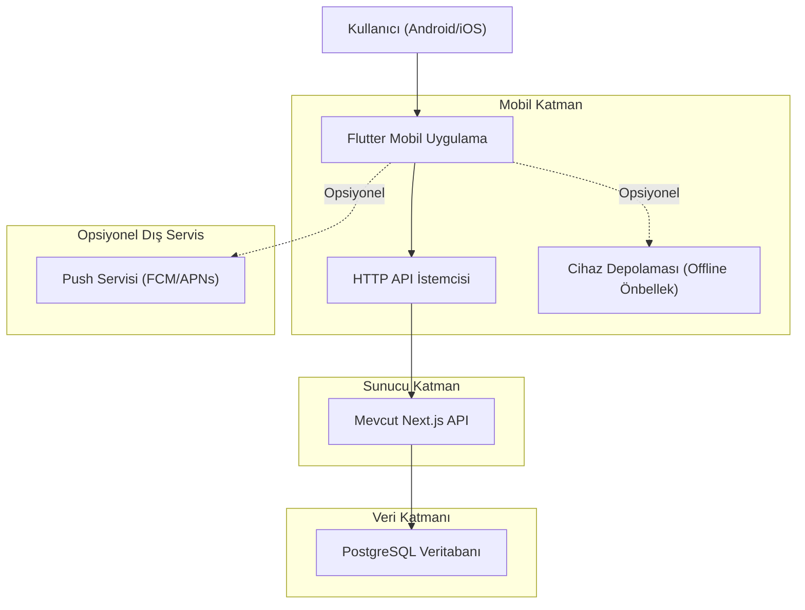
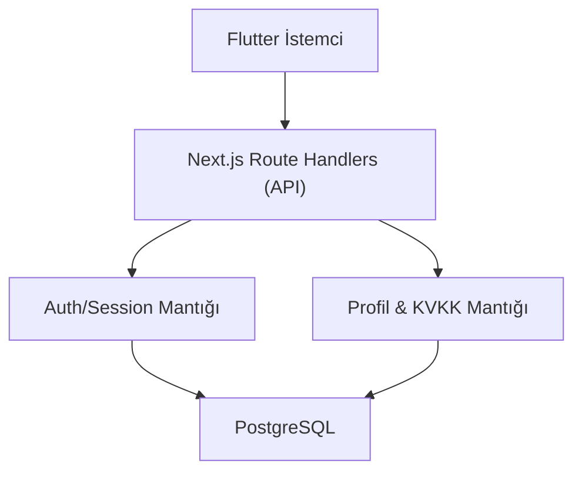
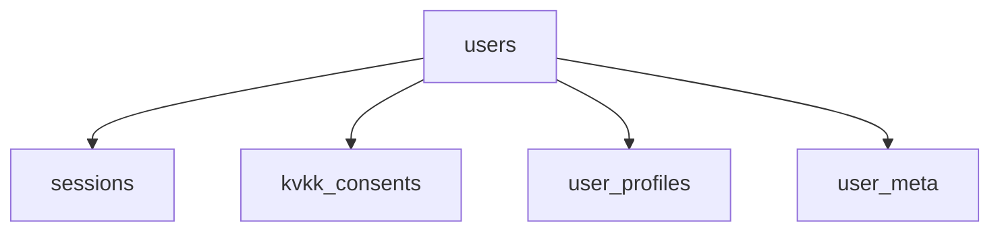

## 1.Architecture design


## 2.Technology Description
- Frontend (Mobil): Flutter (Dart) + Material 3
- Durum yönetimi: Riverpod (veya Bloc)
- Ağ katmanı: Dio + cookie yönetimi (mevcut sistem httpOnly oturum çerezi `otizmSessionV1` kullanıyor)
- Güvenli saklama: flutter_secure_storage (oturum/cookie kalıcılığı için)
- (Opsiyonel) Offline: Hive veya SQLite/Drift (modül içerikleri + profil özet cache)
- Backend: Mevcut Next.js API (REST)
- Database: PostgreSQL (mevcut şema)
- (Opsiyonel) Push: Firebase Messaging (Android) + APNs (iOS)

## 3.Route definitions
| Route | Purpose |
|-------|---------|
| /auth | Giriş/Kayıt + KVKK onayı |
| /home | Modül kartları ve profil özeti |
| /module/:key | Modül ekranı (info, osb, emotions, stories, music, acc, calendar, games) |
| /games/:type | Alt oyun ekranları (coloring, counting, matching, memory, shapes) |
| /family | Çocuk profilleri, kullanıcı bilgileri, gizlilik işlemleri |
| /admin | Yönetici istatistik ekranı |

## 4.API definitions (If it includes backend services)
### 4.1 Core API
Kimlik doğrulama
- `POST /api/auth/register`  Body: `{ email: string, password: string }`  Resp: `{ email: string } | { error: string }`
- `POST /api/auth/login`  Body: `{ email: string, password: string }`  Resp: `{ email: string } | { error: string }`
- `POST /api/auth/logout`  Resp: `{ ok: true }`
- `GET /api/auth/me`  Resp: `{ session: { email: string } | null, kvkkAccepted?: boolean }`

KVKK
- `POST /api/privacy/consent` Body: `{ version: number }` Resp: `{ ok: true, version: number }`

Profil & kullanıcı meta
- `GET /api/profile` Resp: `{ profile: { profiles: Profile[], activeProfileId: string } | null }`
- `POST /api/profile` Body: `{ profiles: Profile[], activeProfileId: string }` Resp: `{ ok: true, updatedAt: string }`
- `GET /api/user-meta` Resp: `{ meta: UserMeta | null }`
- `POST /api/user-meta` Body: `Partial<UserMeta>` Resp: `{ ok: true, updatedAt: string }`

Gizlilik işlemleri
- `GET /api/privacy/export` Resp: JSON dosyası (download)
- `POST /api/privacy/delete` Body: `{ confirm: "SIL", password: string }` Resp: `{ ok: true }`

Yönetim
- `GET /api/admin/stats` Resp: istatistik JSON’u (sadece yönetici)

Ortak tipler (TypeScript gösterimi)
```ts
type Profile = {
  id: string;
  name: string;
  birthDate: string; // YYYY-MM-DD
  familyNotes: string;
  educationNotes: string;
  legacyAge: string;
  photoDataUrl: string;
};

type UserMeta = {
  userFullName: string;
  userPhone: string;
  instructorPhone: string;
  doctorPhone: string;
};
```

## 5.Server architecture diagram (If it includes backend services)


## 6.Data model(if applicable)
### 6.1 Data model definition


### 6.2 Data Definition Language
```sql
CREATE TABLE users (
  id TEXT PRIMARY KEY,
  email TEXT UNIQUE NOT NULL,
  password_hash TEXT NOT NULL,
  salt_b64 TEXT NOT NULL,
  created_at TIMESTAMPTZ NOT NULL
);

CREATE TABLE sessions (
  id TEXT PRIMARY KEY,
  user_id TEXT NOT NULL,
  token_hash_b64 TEXT UNIQUE NOT NULL,
  created_at TIMESTAMPTZ NOT NULL,
  expires_at TIMESTAMPTZ NOT NULL
);

CREATE TABLE kvkk_consents (
  user_id TEXT PRIMARY KEY,
  version INTEGER NOT NULL,
  accepted_at TIMESTAMPTZ NOT NULL
);

CREATE TABLE user_profiles (
  user_id TEXT PRIMARY KEY,
  profiles_json JSONB NOT NULL,
  active_profile_id TEXT NOT NULL,
  updated_at TIMESTAMPTZ NOT NULL
);

CREATE TABLE user_meta (
  user_id TEXT PRIMARY KEY,
  meta_json JSONB NOT NULL,
  updated_at TIMESTAMPTZ NOT NULL
);
```